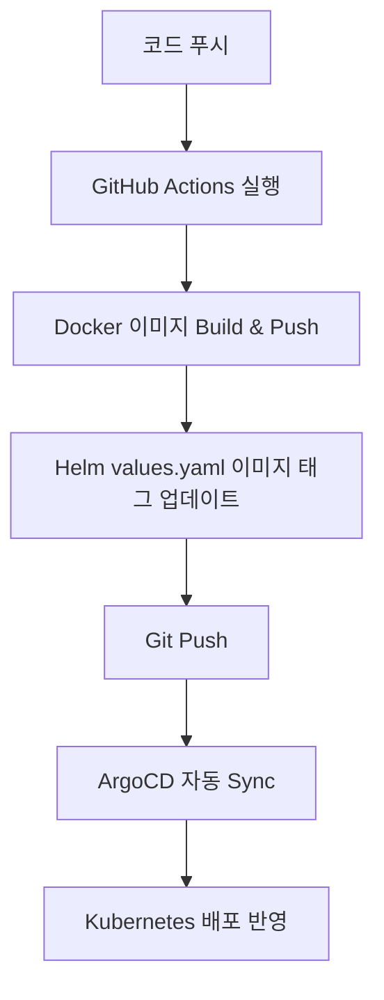

# DevOps Portfolio: Spring Boot + Vue GitOps Dashboard

## 프로젝트 개요
이 프로젝트는 Spring Boot 백엔드와 Vue 프론트엔드를 기반으로, GitHub Actions, Docker, Helm, Argo CD, Kubernetes를 활용한 CI/CD 자동화 및 GitOps 배포 파이프라인을 구현한 DevOps 포트폴리오입니다.

현재는 로컬 Kubernetes 환경(Minikube)에서 동작하는 구조를 갖추고 있으며, 이후 공개형 포트폴리오 사이트로 확장해 이력서에서 바로 접속 가능한 데모 서비스로 발전시키는 것을 목표로 합니다.

## 프로젝트 목표
- 단순 웹 애플리케이션이 아니라 운영과 배포까지 포함한 DevOps 역량을 보여주는 포트폴리오 구축
- Kubernetes 리소스 조회와 인증 기능을 결합한 대시보드 형태의 서비스 제공
- GitOps 기반 자동 배포 흐름을 시각적으로 설명할 수 있는 데모 사이트 구성
- 이력서에 넣을 수 있는 공개 URL 형태의 서비스로 확장

## 기술 스택
- Backend: Java 17, Spring Boot, Spring Security, Spring Data JPA
- Frontend: Vue 3, Vite, Bootstrap, Axios
- Database: MariaDB
- CI/CD: GitHub Actions
- Containerization: Docker, DockerHub
- Kubernetes: Minikube
- Deployment Automation: Helm, Argo CD

## 전체 배포 흐름


## 서비스 방향
이 프로젝트는 최종적으로 "Kubernetes 운영 현황과 GitOps 배포 흐름을 한눈에 보여주는 DevOps 포트폴리오 대시보드"를 목표로 합니다.

핵심 방향은 다음과 같습니다.
- 운영 상태가 보이는 대시보드형 UI 구성
- 인증 기능과 사용자 상태 표시
- Kubernetes 리소스 조회 기능 제공
- GitHub Actions, Docker, Helm, Argo CD로 이어지는 배포 흐름 시각화

## 화면 기획

### 1. Overview
- 프로젝트 소개와 핵심 메시지 표시
- Pods, Deployments, Services, API Health, DB Health 상태 카드 제공
- 최근 Pod / Deployment 현황 요약
- 배포 파이프라인 흐름 미리보기 제공

### 2. Cluster
- Pod 목록 조회
- Deployment 목록 조회
- Service 목록 조회
- Namespace 필터 및 상태 배지 제공

### 3. Pipeline
- `Git Push -> GitHub Actions -> Docker -> Helm -> ArgoCD -> Kubernetes` 흐름 시각화
- 현재 배포 버전과 최근 배포 상태 표시

### 4. Auth
- 로그인 / 회원가입
- JWT 유효성 확인
- 현재 사용자 정보 조회

### 5. About
- 프로젝트 제작 배경
- 아키텍처 설명
- GitHub, DockerHub, README 링크 제공

## 현재 구현 범위
- Spring Boot 인증 API
- JWT 기반 로그인 구조
- Kubernetes 리소스 조회/명령 API
- Helm Chart 기반 배포 구성
- Argo CD 앱 등록 및 동기화 스크립트
- Vue 프론트엔드 기본 레이아웃

## 서비스 아키텍처
- Spring Boot 앱은 `/api` 컨텍스트 경로 아래에서 인증, 헬스체크, Kubernetes API를 제공합니다.
- Vue 프론트엔드는 대시보드 UI를 담당합니다.
- Helm Chart를 통해 Kubernetes에 애플리케이션을 배포합니다.
- Argo CD가 Git 저장소를 추적하며 자동 동기화를 수행합니다.

## 디렉토리 구조
```text
.
├── frontend/                  # Vue 프론트엔드
├── springboot-app/            # Spring Boot 백엔드
├── springboot-helm-chart/     # Helm Chart
├── mariadb/                   # MariaDB Kubernetes 리소스
├── initshell/                 # 초기 설치 및 배포 스크립트
└── README.md
```

## 로컬 실행 및 테스트

### 접속 방식
- `/etc/hosts`에 다음 내용을 추가합니다.

```text
127.0.0.1 springboot.local
```

- 브라우저에서 `http://springboot.local` 로 접속합니다.

### 참고 명령어
```bash
kubectl get all
kubectl describe pod <pod-name>
kubectl port-forward svc/springboot-service 8080:80
curl http://localhost:8080
```

## 공개 배포 확장 계획
이력서에서 바로 접속 가능한 서비스로 확장하기 위해 다음 구조를 고려하고 있습니다.

- Frontend: Vercel 또는 Netlify
- Backend: Render
- Database: 외부 관리형 DB
- Kubernetes: 외부 접근 가능한 클러스터

배포용 환경변수 예시는 다음 파일에 정리했습니다.
- 백엔드 Render 예시: [springboot-app/.env.render.example](/Users/bhmin/Desktop/project/bhminproject/springboot-app/.env.render.example)
- 프론트엔드 Vite 예시: [frontend/.env.example](/Users/bhmin/Desktop/project/bhminproject/frontend/.env.example)
- 실제 배포 절차 가이드: [DEPLOYMENT_GUIDE.md](/Users/bhmin/Desktop/project/bhminproject/DEPLOYMENT_GUIDE.md)

## 공개 환경에서의 운영 원칙
- Kubernetes 조회 기능을 우선 공개
- 삭제, 스케일링 등 명령형 기능은 관리자 전용 또는 비활성화
- DB 접속 정보, JWT 키, Kubernetes 인증 정보는 코드에 하드코딩하지 않음
- 로컬 전용 Minikube 주소는 공개 배포용 설정으로 분리

## 향후 개선 계획
- 프론트엔드를 운영 대시보드 스타일로 개편
- Swagger/OpenAPI 및 Actuator 추가
- HTTPS 및 커스텀 도메인 연결
- 환경별 values 분리(dev/stage/prod)
- HPA, 리소스 제한, 모니터링 강화
- 공개 포트폴리오용 샘플 데이터 또는 읽기 전용 클러스터 모드 지원

## 만든 사람
- GitHub: [bhmin9211](https://github.com/bhmin9211)
- DockerHub: [byunghyukmin](https://hub.docker.com/u/byunghyukmin)

> 이 프로젝트는 DevOps 개인 포트폴리오를 목표로 발전 중인 서비스입니다.
