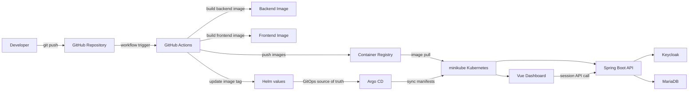

# Spring Boot + Vue GitOps Operations Dashboard

## 프로젝트 개요

이 프로젝트는 `Spring Boot + Vue` 기반으로 만든 운영형 플랫폼 포트폴리오입니다.  
단순 CRUD가 아니라 `인증`, `Kubernetes 운영 상태`, `역할 기반 제어`, `GitHub Actions + Helm` 중심의 GitOps 배포 흐름을 하나의 제품 경험으로 보여주는 것을 목표로 합니다.

핵심 방향:

- Keycloak 기반 세션 인증
- Kubernetes 운영 상태 조회와 운영 판단형 대시보드
- `VIEWER / OPERATOR / ADMIN` 역할 모델
- GitHub Actions -> Docker image -> Helm values -> Kubernetes 반영 흐름 시각화
- 공개 포트폴리오와 내부 운영 콘솔을 함께 고려한 구조

## 무엇을 보여주는 프로젝트인가

- 단순 리소스 조회기가 아니라 운영 판단이 가능한 대시보드
- 프론트 토큰 저장이 아닌 `Spring Boot BFF + session` 인증 구조
- 역할 기반 운영 콘솔로 확장 가능한 권한 설계
- GitHub Actions와 Helm 중심의 배포 자동화 흐름
- 운영 상태와 최근 배포 이력을 함께 보여주는 GitOps 스토리

## 현재 구조

### Frontend

- Vue 3
- Vite
- Vue Router
- Axios

주요 역할:

- 운영형 대시보드 UI 제공
- 로그인 진입 UX 제공
- 세션 기반 API 호출
- 상태/배포/권한 정보 시각화

### Backend

- Java 17
- Spring Boot 3
- Spring Security
- OAuth2 Client
- JPA

주요 역할:

- Keycloak 기반 로그인 흐름 시작과 세션 유지
- Kubernetes 조회 API 제공
- 역할 기반 보호 API 제공
- 향후 release summary / audit log / 운영 집계 응답 제공

### Infra / Delivery

- Docker
- Docker Compose
- Helm chart
- GitHub Actions

주요 역할:

- 로컬 개발 환경 구성
- 컨테이너 이미지 빌드와 push
- 이미지 태그 갱신
- Helm 기반 배포 값 반영

## GitOps 핵심 흐름

이 프로젝트의 배포 스토리는 아래 흐름으로 설명됩니다.

1. 개발자가 GitHub에 코드를 push 합니다.
2. GitHub Actions가 애플리케이션 이미지를 빌드하고 registry에 push 합니다.
3. workflow가 Helm values의 이미지 태그를 새 commit SHA 기준으로 갱신합니다.
4. Kubernetes 환경은 Helm values 변경을 기준으로 새 버전을 반영합니다.
5. 대시보드는 현재 배포 상태와 최근 릴리즈 정보를 보여줍니다.

즉 이 프로젝트는 `앱 개발 + 배포 자동화 + 운영 가시성`을 하나의 흐름으로 설명할 수 있어야 합니다.

### 빌드 / 배포 다이어그램



다이어그램 기준 핵심 포인트:

- GitHub Actions가 이미지 빌드와 태그 갱신을 담당합니다.
- Helm values가 배포 버전의 기준점 역할을 합니다.
- Argo CD가 Git 상태를 읽고 minikube 클러스터와 동기화합니다.
- 런타임에서는 Vue 대시보드가 Spring Boot API를 호출하고, 백엔드는 Keycloak과 MariaDB를 사용합니다.

## 주요 기능

### 1. 인증

- Keycloak 기반 로그인
- Spring Boot가 OAuth2 login과 세션을 관리하는 BFF 구조
- 프론트는 토큰을 직접 저장하지 않고 `withCredentials` 기반으로 동작
- `/auth/me`, `/auth/status`, `/auth/logout` 제공

### 2. Kubernetes Dashboard

- Pods 조회
- Deployments 조회
- Services 조회
- Namespaces 조회
- Nodes 조회
- Cluster overview 조회

### 3. 운영 정책 분리

- 공개 환경에서는 명령형 기능 비활성화 가능
- Kubernetes 명령 기능 on/off 분리
- 향후 역할별 권한 차등 적용 예정

### 4. Release / GitOps Story

- GitHub Actions 기반 빌드/배포 메타데이터 연결
- Docker image tag 추적
- Helm values 업데이트
- Kubernetes 반영 흐름 설명

## 인증 아키텍처

현재 인증 구조는 `프론트 토큰 보관` 방식이 아니라 `백엔드 세션 관리` 방식입니다.

- 사용자는 프론트 로그인 버튼을 클릭합니다.
- 백엔드가 Keycloak 로그인 흐름을 시작합니다.
- Keycloak 인증 성공 후 백엔드 callback으로 복귀합니다.
- 백엔드가 세션을 유지합니다.
- 프론트는 세션 쿠키 기반으로 API를 호출합니다.

즉:

- Keycloak이 인증 담당
- Spring Boot가 세션/보호 API 담당
- Vue는 커스텀 로그인 UI와 대시보드 담당

## 역할 모델

현재 프로젝트는 아래 3단계 역할 모델을 기준으로 확장 중입니다.

- `VIEWER`: 조회 전용
- `OPERATOR`: 제한적 운영 기능
- `ADMIN`: 전체 관리 권한

이 역할 모델은 다음 항목에 연결됩니다.

- 페이지 접근
- 버튼 노출 차등
- API 권한 검사
- 감사 로그

## 로컬 개발 전략

결론부터 말하면 `로컬 개발 전체를 항상 minikube로 돌리는 것`보다,  
`일상 개발은 docker compose`, `배포 검증과 GitOps 시연은 minikube + helm` 조합이 더 적합합니다.

### 권장 이유

- 인증, 백엔드, 프론트 기능 개발은 `compose.local.yml`이 더 빠르고 단순합니다.
- Helm chart 검증과 Kubernetes 리소스 확인은 `minikube`가 더 적합합니다.
- 포트폴리오 관점에서도 개발 환경과 배포 검증 환경을 분리하는 편이 더 실무적으로 보입니다.

### 권장 운영 방식

1. 평소 기능 개발:
   - `docker-compose -f compose.local.yml up --build`
2. 기본 GitOps 시연:
   - `minikube start`
   - `Argo CD`로 chart 등록 및 sync
3. 빠른 Helm 검증:
   - 로컬 이미지 build
   - `helm upgrade --install ...`

### 왜 compose를 유지하는가

- Keycloak과 MariaDB를 포함한 전체 인증 흐름을 빠르게 확인하기 가장 쉽습니다.
- 백엔드/프론트 기능 개발 속도가 `minikube`보다 훨씬 빠릅니다.
- `minikube`는 Helm, ingress, local image build, GitOps 시연 검증에 집중시키는 편이 더 좋습니다.

즉 이 프로젝트에서는 `compose 삭제`보다 `compose와 minikube 역할 분리`가 더 적합합니다.
그리고 포트폴리오 시연 기본 경로는 `Argo CD 포함`으로 가져가는 편이 더 좋습니다.

## 로컬 실행

가장 간단한 실행 방식은 `compose.local.yml`입니다.

포함 서비스:

- MariaDB
- Keycloak
- Spring Boot Backend
- Vue Frontend

실행:

```bash
docker-compose -f compose.local.yml up --build
```

기본 접속 주소:

- Frontend: `http://localhost:3000`
- Backend API: `http://localhost:8081/api`
- Keycloak: `http://localhost:8090`

Keycloak Admin 계정:

- `admin / admin1234`

## minikube 배포 검증

macOS 기준 추천 흐름:

1. CLI 설치

```bash
./initshell/install-cli.sh
```

2. minikube 시작

```bash
./initshell/setup-all.sh
```

3. 호스트 인프라 실행

```bash
docker-compose -f compose.local.yml up -d mariadb keycloak-db keycloak
```

4. 기본 GitOps 경로

```bash
./initshell/register-argocd.sh
```

5. 빠른 Helm 검증이 필요할 때만

```bash
./initshell/quick-deploy.sh
```

관련 파일:

- [initshell/README.md](/Users/bhmin/Desktop/project/bhminproject/initshell/README.md)
- [springboot-helm-chart/minikube-values.yaml](/Users/bhmin/Desktop/project/bhminproject/springboot-helm-chart/minikube-values.yaml)

샘플 로그인 계정:

- `viewer / viewer1234`
- `operator / operator1234`
- `admin / admin1234`

## 환경변수 예시

- Backend: [springboot-app/.env.render.example](/Users/bhmin/Desktop/project/bhminproject/springboot-app/.env.render.example)
- Frontend: [frontend/.env.example](/Users/bhmin/Desktop/project/bhminproject/frontend/.env.example)

중요 설정 예시:

- `SPRING_SECURITY_OAUTH2_CLIENT_PROVIDER_KEYCLOAK_ISSUER_URI`
- `SPRING_SECURITY_OAUTH2_CLIENT_REGISTRATION_KEYCLOAK_CLIENT_ID`
- `SPRING_SECURITY_OAUTH2_CLIENT_REGISTRATION_KEYCLOAK_CLIENT_SECRET`
- `APP_SECURITY_FRONTEND_BASE_URL`
- `VITE_API_BASE_URL`

## 디렉토리 구조

```text
.
├── agent/                     # 아키텍처/작업 문서
├── frontend/                  # Vue 프론트엔드
├── infra/keycloak/import/     # 로컬 Keycloak realm import
├── springboot-app/            # Spring Boot 백엔드
├── springboot-helm-chart/     # Helm Chart
├── mariadb/                   # DB 관련 리소스
├── initshell/                 # 초기 배포 스크립트
├── compose.local.yml          # 로컬 통합 실행
└── README.md
```

## 로드맵

가까운 다음 작업:

1. Role Enforcement Phase 1
2. Operational Readiness Dashboard
3. Release Intelligence
4. Access / Audit Center
5. README / About의 GitOps 설명 강화

문서:

- [agent/INDEX.md](/Users/bhmin/Desktop/project/bhminproject/agent/INDEX.md)
- [agent/architecture/upgrade_plan.md](/Users/bhmin/Desktop/project/bhminproject/agent/architecture/upgrade_plan.md)
- [agent/architecture/KEYCLOAK_IMPLEMENTATION_PLAN.md](/Users/bhmin/Desktop/project/bhminproject/agent/architecture/KEYCLOAK_IMPLEMENTATION_PLAN.md)
- [agent/architecture/ROLE_MODEL_IDEAS.md](/Users/bhmin/Desktop/project/bhminproject/agent/architecture/ROLE_MODEL_IDEAS.md)
- [agent/architecture/PROJECT_EXPANSION_IDEAS.md](/Users/bhmin/Desktop/project/bhminproject/agent/architecture/PROJECT_EXPANSION_IDEAS.md)

## 공개 배포 방향

목표 배포 구조:

- Frontend: 정적 배포 또는 컨테이너 기반 배포
- Backend: 컨테이너 기반 배포
- Auth: 외부 Keycloak
- Database: 외부 MariaDB
- Kubernetes: 읽기 전용 또는 제한적 운영 권한 클러스터

공개 환경 운영 원칙:

- 조회 기능 우선 공개
- 위험한 명령형 기능은 관리자 전용 또는 비활성화
- 인증 토큰은 프론트에 직접 저장하지 않음
- 환경별 설정 분리

## 만든 사람

- GitHub: [bhmin9211](https://github.com/bhmin9211)
- DockerHub: [byunghyukmin](https://hub.docker.com/u/byunghyukmin)

> 이 프로젝트는 GitOps 배포 흐름과 운영 가시성을 함께 보여주는 운영형 포트폴리오를 목표로 계속 확장 중입니다.
