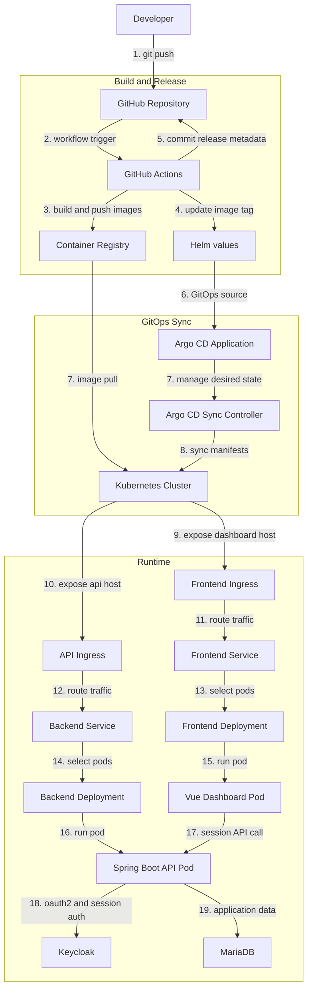

# Spring Boot + Vue GitOps Operations Dashboard

## 프로젝트 소개

이 프로젝트는 `Spring Boot + Vue` 기반으로 만든 운영형 플랫폼 포트폴리오입니다.  
단순한 CRUD 애플리케이션이 아니라 `인증`, `운영 상태 가시화`, `역할 기반 접근 제어`, `GitOps 배포 흐름`을 하나의 제품 경험으로 보여주는 것을 목표로 합니다.

사용자는 대시보드에서 서비스 상태와 배포 흐름을 확인할 수 있고, 프로젝트는 실제 운영 환경을 고려한 인증, 배포, 운영 구조를 함께 담도록 설계되어 있습니다.

## 프로젝트 목표

- Keycloak 기반 인증과 세션 중심 보안 구조 구현
- Kubernetes 운영 상태를 확인할 수 있는 대시보드 제공
- `VIEWER / OPERATOR / ADMIN` 역할 기반 확장 구조 설계
- GitHub Actions, Docker, Helm을 연결한 GitOps 배포 흐름 표현
- 공개 포트폴리오와 내부 운영 콘솔 성격을 함께 담은 아키텍처 구성

## 핵심 특징

- 프론트에서 토큰을 직접 저장하지 않는 `Spring Boot BFF + Session` 인증 구조
- Kubernetes 리소스와 운영 상태를 시각적으로 확인할 수 있는 대시보드
- 역할에 따라 기능과 접근 범위를 구분할 수 있는 권한 모델
- 빌드부터 이미지 반영, 배포 버전 관리까지 이어지는 GitOps 중심 운영 흐름
- 애플리케이션 개발, 배포 자동화, 운영 가시성을 하나의 흐름으로 설명할 수 있는 프로젝트 구성

## 기술 구성

### Frontend

- Vue 3
- Vite
- Vue Router
- Axios

### Backend

- Java 17
- Spring Boot 3
- Spring Security
- OAuth2 Client
- JPA

### Infra / Delivery

- Docker
- Docker Compose
- Helm
- GitHub Actions
- Kubernetes

## 배포 절차

이 프로젝트의 배포 흐름은 GitOps 관점에서 아래 단계로 설명됩니다.

1. 개발자가 GitHub 저장소에 코드를 반영합니다.
2. GitHub Actions가 프론트엔드와 백엔드 이미지를 빌드하고 레지스트리에 푸시합니다.
3. 배포 워크플로우가 Helm values의 이미지 태그를 최신 커밋 기준으로 갱신합니다.
4. Kubernetes 환경은 Git에 반영된 Helm values를 기준으로 새 버전을 동기화합니다.
5. 대시보드는 현재 운영 상태와 배포 흐름을 함께 보여줍니다.

이 과정을 통해 `코드 변경`, `이미지 빌드`, `배포 반영`, `운영 가시화`가 하나의 흐름으로 연결됩니다.

## 아키텍처

프로젝트는 Vue 프론트엔드, Spring Boot 백엔드, Keycloak 인증, MariaDB 저장소, Kubernetes 배포 환경을 중심으로 구성됩니다.  
배포 관점에서는 GitHub Actions, Container Registry, Helm values, Argo CD가 연결되어 GitOps 방식으로 운영됩니다.

아래 다이어그램은 코드 반영부터 이미지 빌드, GitOps 동기화, 실제 서비스 실행까지의 전체 흐름을 보여줍니다.

아키텍처 기준 핵심 포인트:

- 프론트는 세션 기반으로 백엔드 API를 호출하고, 인증은 Keycloak과 Spring Boot가 담당합니다.
- 백엔드는 운영 상태 조회와 보호된 API를 제공하는 중심 계층 역할을 합니다.
- GitHub Actions는 이미지 빌드와 배포 버전 갱신을 담당합니다.
- Helm values와 Argo CD는 Git 상태를 실제 Kubernetes 환경에 반영하는 기준점 역할을 합니다.
- Kubernetes 내부 리소스는 `Ingress -> Service -> Deployment -> Pod` 흐름으로 연결됩니다.

## 기대하는 프로젝트 인상

이 프로젝트는 단순히 화면과 API를 구현한 수준이 아니라,  
실제 서비스 운영에 필요한 인증 구조, 배포 자동화, 운영 가시성을 함께 고려한 포트폴리오를 지향합니다.

즉 `애플리케이션 개발`, `운영 관점의 대시보드 설계`, `GitOps 기반 배포 흐름`을 하나로 연결해 보여주는 프로젝트입니다.
