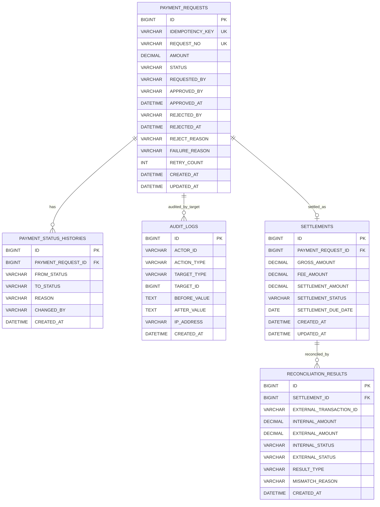
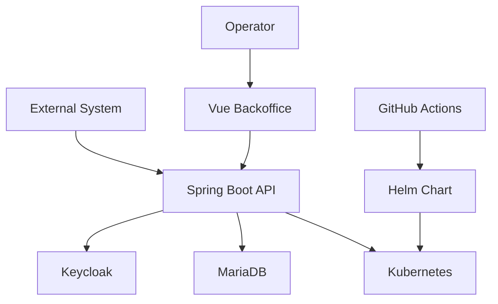

# Payment Settlement Operations Dashboard

## 프로젝트 개요

결제성 업무 요청을 안전하게 접수하고, 운영자가 승인, 반려, 상태 이력, 감사로그, 정산 운영을 관리할 수 있도록 설계한 Java/Spring 기반 운영 백오피스 시스템입니다.

단순 CRUD가 아니라 실제 업무시스템에서 자주 발생하는 중복 요청, 잘못된 상태 변경, 운영자 승인 이력 누락, 장애 추적 어려움 같은 문제를 다루는 것을 목표로 합니다.

기존 운영 대시보드 구조를 확장해 `Spring Boot + Vue + Keycloak + MariaDB` 기반 백오피스 흐름을 만들고, Docker, Helm, Kubernetes 배포 구성을 함께 포함했습니다.

## 개발 배경

결제, 환불, 정산, 문서 발급 같은 업무 요청은 네트워크 재시도나 사용자 중복 클릭으로 같은 요청이 여러 번 들어올 수 있습니다. 또한 운영자가 승인, 반려, 재처리, 정산 확정 같은 행위를 수행할 때 누가 언제 어떤 상태를 바꾸었는지 추적할 수 있어야 합니다.

이 프로젝트는 이런 운영 업무의 핵심을 백엔드 관점에서 설계하고 구현합니다.

## 주요 기능

- 결제성 업무 요청 등록
- `idempotencyKey` 기반 중복 요청 방지
- 요청 상태 전이 관리
- 운영자 승인/반려
- 처리 성공/실패 및 실패 건 재처리
- 상태 변경 이력 저장
- 운영자 행위 감사로그 저장
- 성공 거래 기반 정산 데이터 생성
- 내부/외부 정산 결과 대사
- Keycloak 기반 로그인 및 Role 기반 API 접근 제어
- Kubernetes 운영 상태 조회 대시보드
- Docker, Helm 기반 배포 구성

## 핵심 설계 포인트

### 멱등성

동일한 `idempotencyKey`가 이미 존재하면 새 요청을 만들지 않고 기존 요청의 처리 결과를 반환합니다. 애플리케이션 레벨의 선조회와 DB Unique Key를 함께 사용해 동시 요청 상황에서도 중복 저장을 방지합니다.

### 상태 전이

요청 상태는 다음 흐름을 기준으로 관리합니다.

```text
REQUESTED -> APPROVED -> PROCESSING -> SUCCESS -> SETTLED
REQUESTED -> REJECTED
PROCESSING -> FAILED -> RETRYING -> SUCCESS
```

허용되지 않은 상태 변경은 예외 처리하고, 정상 상태 변경은 `PAYMENT_STATUS_HISTORIES` 테이블에 저장합니다.

### 감사로그

요청 등록, 승인, 반려 같은 주요 운영 행위는 `AUDIT_LOGS` 테이블에 저장합니다. 감사로그에는 행위자, 액션 타입, 대상 타입, 대상 ID, 변경 전후 값, IP, 처리 시각을 기록합니다.

### 권한 관리

Keycloak에서 전달된 역할을 Spring Security 권한으로 매핑합니다.

| 기능 | VIEWER | OPERATOR | ADMIN |
|---|---:|---:|---:|
| 요청 조회 | O | O | O |
| 승인/반려 | X | O | O |
| Kubernetes 상태 조회 | O | O | O |
| Kubernetes 명령 실행 | X | O | O |

## API 명세

서버 기본 context path는 `/api`입니다.

| Method | URL | 설명 | 권한 |
|---|---|---|---|
| POST | `/api/payment-requests` | 결제 요청 등록 | 공개/시스템 연동 |
| GET | `/api/payment-requests` | 결제 요청 목록 조회 | VIEWER 이상 |
| GET | `/api/payment-requests/{id}` | 결제 요청 상세 조회 | VIEWER 이상 |
| POST | `/api/payment-requests/{id}/approve` | 결제 요청 승인 | OPERATOR 이상 |
| POST | `/api/payment-requests/{id}/reject` | 결제 요청 반려 | OPERATOR 이상 |
| POST | `/api/payment-requests/{id}/process` | 결제 요청 처리 시작 | OPERATOR 이상 |
| POST | `/api/payment-requests/{id}/success` | 결제 요청 성공 처리 | OPERATOR 이상 |
| POST | `/api/payment-requests/{id}/fail` | 결제 요청 실패 처리 | OPERATOR 이상 |
| POST | `/api/payment-requests/{id}/retry` | 실패 건 재처리 | OPERATOR 이상 |
| GET | `/api/payment-requests/{id}/histories` | 상태 변경 이력 조회 | VIEWER 이상 |
| POST | `/api/settlements/generate` | 정산 데이터 생성 | OPERATOR 이상 |
| GET | `/api/settlements` | 정산 목록 조회 | VIEWER 이상 |
| GET | `/api/settlements/{id}` | 정산 상세 조회 | VIEWER 이상 |
| POST | `/api/reconciliations` | 정산 대사 실행 | OPERATOR 이상 |
| GET | `/api/reconciliations` | 대사 결과 조회 | VIEWER 이상 |
| GET | `/api/reconciliations/mismatches` | 대사 불일치 조회 | VIEWER 이상 |
| GET | `/api/audit-logs` | 감사로그 조회 | VIEWER 이상 |
| GET | `/api/k8s/cluster/info` | Kubernetes 클러스터 정보 조회 | VIEWER 이상 |
| GET | `/api/k8s/pods` | Pod 목록 조회 | VIEWER 이상 |

### 요청 등록 예시

```http
POST /api/payment-requests
Content-Type: application/json

{
  "idempotencyKey": "PAY-ORDER-20260530-0001",
  "amount": 120000,
  "requestedBy": "external-order-api"
}
```

### 반려 예시

```http
POST /api/payment-requests/1/reject
Content-Type: application/json

{
  "reason": "요청 금액과 증빙 금액이 일치하지 않습니다."
}
```

## ERD


```mermaid
erDiagram
    PAYMENT_REQUESTS ||--o{ PAYMENT_STATUS_HISTORIES : has
    PAYMENT_REQUESTS ||--o{ AUDIT_LOGS : audited_by_target
    PAYMENT_REQUESTS ||--o| SETTLEMENTS : settled_as
    SETTLEMENTS ||--o{ RECONCILIATION_RESULTS : reconciled_by

    PAYMENT_REQUESTS {
        BIGINT ID PK
        VARCHAR IDEMPOTENCY_KEY UK
        VARCHAR REQUEST_NO UK
        DECIMAL AMOUNT
        VARCHAR STATUS
        VARCHAR REQUESTED_BY
        VARCHAR APPROVED_BY
        DATETIME APPROVED_AT
        VARCHAR REJECTED_BY
        DATETIME REJECTED_AT
        VARCHAR REJECT_REASON
        VARCHAR FAILURE_REASON
        INT RETRY_COUNT
        DATETIME CREATED_AT
        DATETIME UPDATED_AT
    }

    PAYMENT_STATUS_HISTORIES {
        BIGINT ID PK
        BIGINT PAYMENT_REQUEST_ID FK
        VARCHAR FROM_STATUS
        VARCHAR TO_STATUS
        VARCHAR REASON
        VARCHAR CHANGED_BY
        DATETIME CREATED_AT
    }

    AUDIT_LOGS {
        BIGINT ID PK
        VARCHAR ACTOR_ID
        VARCHAR ACTION_TYPE
        VARCHAR TARGET_TYPE
        BIGINT TARGET_ID
        TEXT BEFORE_VALUE
        TEXT AFTER_VALUE
        VARCHAR IP_ADDRESS
        DATETIME CREATED_AT
    }

    SETTLEMENTS {
        BIGINT ID PK
        BIGINT PAYMENT_REQUEST_ID FK
        DECIMAL GROSS_AMOUNT
        DECIMAL FEE_AMOUNT
        DECIMAL SETTLEMENT_AMOUNT
        VARCHAR SETTLEMENT_STATUS
        DATE SETTLEMENT_DUE_DATE
        DATETIME CREATED_AT
        DATETIME UPDATED_AT
    }

    RECONCILIATION_RESULTS {
        BIGINT ID PK
        BIGINT SETTLEMENT_ID FK
        VARCHAR EXTERNAL_TRANSACTION_ID
        DECIMAL INTERNAL_AMOUNT
        DECIMAL EXTERNAL_AMOUNT
        VARCHAR INTERNAL_STATUS
        VARCHAR EXTERNAL_STATUS
        VARCHAR RESULT_TYPE
        VARCHAR MISMATCH_REASON
        DATETIME CREATED_AT
    }
```

## 시스템 아키텍처


```mermaid
flowchart TD
    Operator[Operator]
    External[External System]
    Frontend[Vue Backoffice]
    Backend[Spring Boot API]
    Keycloak[Keycloak]
    MariaDB[MariaDB]
    K8s[Kubernetes]
    Helm[Helm Chart]
    Actions[GitHub Actions]

    Operator --> Frontend
    External --> Backend
    Frontend --> Backend
    Backend --> Keycloak
    Backend --> MariaDB
    Backend --> K8s
    Actions --> Helm
    Helm --> K8s
```

## 기술 스택

| 영역 | 기술 |
|---|---|
| Backend | Java 17, Spring Boot 3, Spring Security, JPA |
| Frontend | Vue 3, Vite, Vue Router, Axios |
| Auth | Keycloak, OAuth2 Login, Session |
| DB | MariaDB |
| Infra | Docker, Docker Compose, Helm, Kubernetes |
| CI/CD | GitHub Actions |

## Frontend

프론트엔드는 백엔드 API의 운영 흐름을 확인하기 위한 Vue 기반 관리자 화면입니다. 화려한 UI보다 운영자가 실제로 수행하는 업무 흐름을 보여주는 것을 목표로 합니다.

| 화면 | 설명 |
|---|---|
| 결제 요청 목록 | 요청 목록 조회, 상태별 필터링, 신규 요청 등록, 상세 이동 |
| 결제 요청 상세 | 승인, 반려, 처리 시작, 성공/실패 처리, 재처리, 상태 이력, 감사로그 확인 |
| 정산 목록 | 성공 거래 기준 정산 데이터 조회 및 생성 |
| 대사 결과 | 내부/외부 정산 결과 비교 및 불일치 건 조회 |

## 실행 방법

### Backend

```bash
cd springboot-app
./gradlew bootRun --args='--spring.profiles.active=local'
```

### Frontend

```bash
cd frontend
npm install
npm run dev
```

### DB 스키마

MariaDB에 아래 SQL을 적용합니다.

```text
springboot-app/src/main/resources/sql/payment_settlement.sql
```

## 구현 현황

- 완료: 결제 요청 등록
- 완료: 멱등키 기반 중복 요청 방지
- 완료: 승인/반려 상태 전이
- 완료: 처리/성공/실패/재처리 상태 전이
- 완료: 상태 변경 이력
- 완료: 감사로그 저장/조회
- 완료: 정산 데이터 생성/조회
- 완료: 정산 대사 및 불일치 조회
- 완료: Keycloak Role 기반 보호 API 구조
- 완료: Vue 관리자 화면의 결제 요청 목록/상세/상태 변경 액션
- 완료: 정산/대사 화면
- 진행 예정: 서비스 테스트 코드
